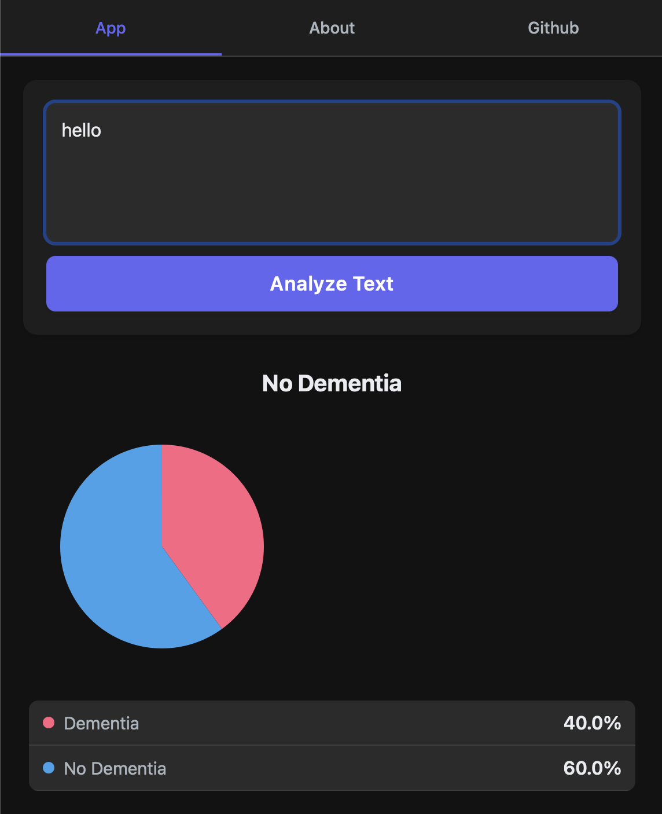
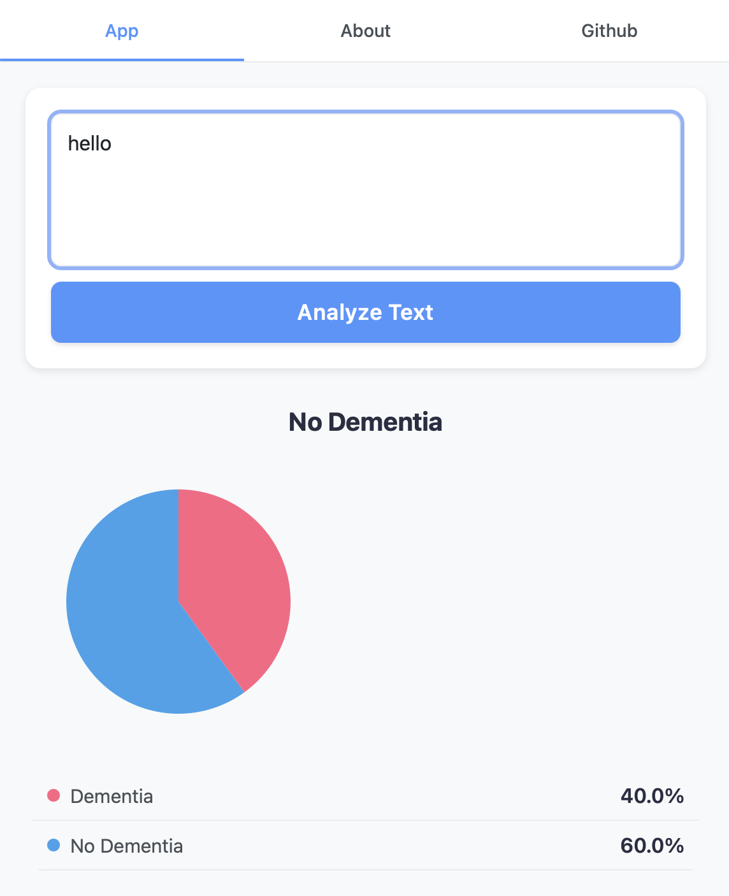

# React Native Dementia Analysis App

## Overview

This is a **React Native** application designed for analyzing text and predicting the likelihood of dementia. It provides an **interactive UI, real-time data visualization, multi-screen navigation, and support for both light and dark modes**.

---

## **Project Requirements**

To work on this project as an **open-source contributor**, you need the following dependencies and setup:

### **1. Prerequisites**

Ensure that you have the following installed:

- **Node.js** (LTS version recommended)
- **Yarn** or **npm**
- **React Native CLI**
- **Android Studio** (for Android development)
- **Xcode** (for iOS development, macOS required)
- A **physical or emulator device** (iOS Simulator or Android Emulator)

### **2. Installation Steps**

#### **Clone the Repository**

```sh
 git clone https://github.com/OX-S/early-trace.git
 cd early-trace
```

#### **Install Dependencies**

```sh
npm install   # or yarn install
```

#### **Start Metro Bundler**

```sh
npx expo start
```

#### **Run on Android**

```sh
npm run android  # or yarn android
```

#### **Run on iOS** (MacOS Required)

```sh
npx pod-install  # Install CocoaPods dependencies
npm run ios  # or yarn ios
```

---

## **Features Implemented**

### **1. Dark and Light Mode Support**

- The app **automatically detects the user's system theme** (`useColorScheme()`).
- UI elements such as backgrounds, text colors, and buttons adjust dynamically.
- Dark mode enhances **readability and user experience** in low-light environments.

Below is a visual demonstration of both modes:

#### **Dark Mode**


#### **Light Mode**


### **2. Multi-Screen Navigation**

- **NavBar Component** enables navigation between:
  - **App** (Main text input & analysis)
  - **About** (Information about the project)
  - **GitHub** (Link to open-source repository)
- Includes an **animated navigation indicator** for better UI feedback.

### **3. Dementia Analysis Simulation**

- Users enter text for analysis.
- A **simulated API function** (`simulateAPI`) connects to a backend endpoint:
  - Prediction result (e.g., *No Dementia* or *Dementia*)
  - Probability values for **dementia and non-dementia cases**.

### **4. Data Visualization with Pie Charts**

- Uses `react-native-chart-kit` to display probabilities in a **pie chart**.
- The chart dynamically updates based on **analysis results**.

### **5. Mobile-Friendly & Responsive UI**

- Utilizes `Dimensions.get('window')` to adjust UI for different screen sizes.
- Uses **KeyboardAvoidingView** for an improved typing experience on mobile devices.

### **6. GitHub Integration**

- The **GitHub tab** provides a direct link to the repository.
- Features an interactive **GitHub card** with:
  - **Repository name**
  - **Short project description**
  - **External link to GitHub** (opened via `Linking.openURL`).

---

## **Libraries Used**

This project leverages the following libraries and tools:

- **React Native**: Framework for building native apps using React.
- **Expo**: Toolchain for simplifying React Native development.
- **react-native-reanimated**: For implementing animations with better performance.
- **react-native-chart-kit**: For creating data visualizations like pie charts.
- **react-native-vector-icons**: For using scalable vector icons in the app.
- **react-native-gesture-handler**: For handling gestures in navigation and animations.
- **KeyboardAvoidingView**: To enhance user input experiences on mobile.

---

## **Future Enhancements**

Some potential improvements for contributors:

- **Implement a different text based backend** to replace the simulated dimentia API.
- **Add accessibility features** such as VoiceOver/TalkBack support.
- **Localization support** for multiple languages.
- **User authentication** for saving previous analyses.

---

## **Contributing**

Contributions are welcome! Please follow these steps:

1. **Fork the repository**.
2. **Create a feature branch** (`git checkout -b feature-branch`).
3. **Commit your changes** (`git commit -m "Add new feature"`).
4. **Push to your branch** (`git push origin feature-branch`).
5. **Submit a Pull Request**.

For major changes, please open an issue first to discuss what you'd like to change.

---


This **React Native application** is **well-structured, visually interactive, and mobile-responsive**. It provides opportunities for **contributors to improve features, optimize performance, and expand its capabilities**. 🚀

